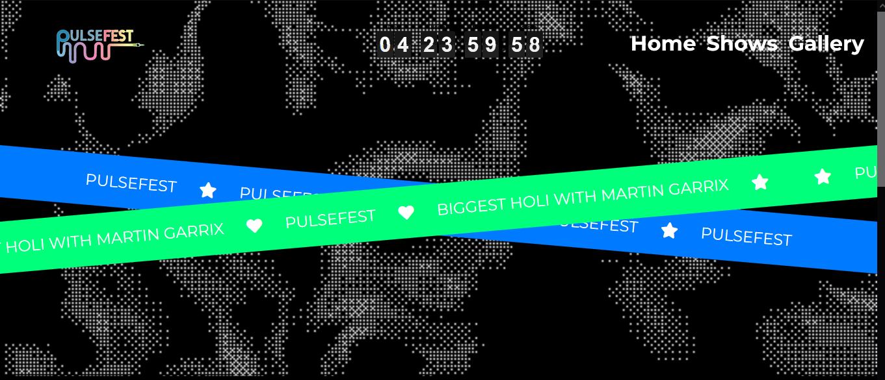

# PulseFest

## Description
PulseFest is a vibrant and exciting festival website that showcases the lineup of events, artists, and ticketing information for the biggest Holi celebration featuring Martin Garrix. The website provides users with detailed information about the concerts, artists, and ticket tiers available for purchase. It also includes a countdown timer, banners, and social media links to keep users engaged and informed.

## Deploy Link
[PulseFest Website](https://idyllic-biscuit-dbf17b.netlify.app/)

## Screenshot

## Tech Stack
- **HTML**: For structuring the content of the website.
- **CSS**: For styling the website and making it visually appealing.
- **JavaScript**: For adding interactivity and dynamic content to the website.
- **Bootstrap**: For responsive design and pre-built components.
- **Font Awesome**: For adding icons to the website.
- **Netlify**: For deploying the website.

## Features
- **Responsive Design**: The website is fully responsive and works on all devices.
- **Event Details**: Detailed information about the concerts and artists.
- **Ticketing Information**: Information about different ticket tiers and prices.
- **Countdown Timer**: A countdown timer to the event.
- **Social Media Links**: Links to social media profiles.
- **Interactive Banners**: Eye-catching banners with event information.

## How to Use
1. Visit the [PulseFest Website](https://idyllic-biscuit-dbf17b.netlify.app/).
2. Browse through the event details and artist information.
3. Check out the different ticket tiers and prices.
4. Use the social media links to follow PulseFest on various platforms.
5. Purchase tickets through the provided links.

## Contributing
If you would like to contribute to this project, please fork the repository and submit a pull request with your changes.

## License
This project is licensed under the MIT License.